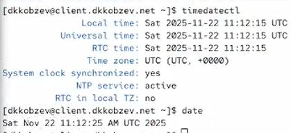
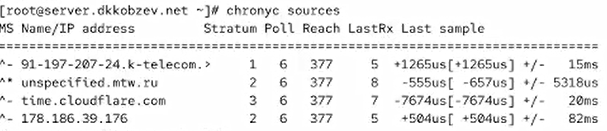
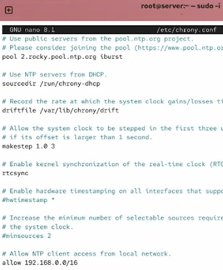
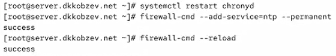
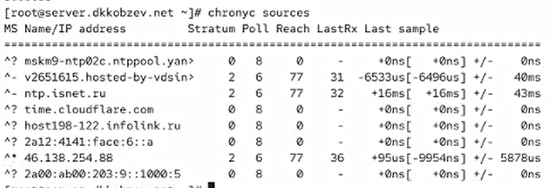
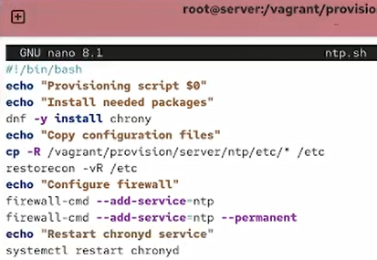
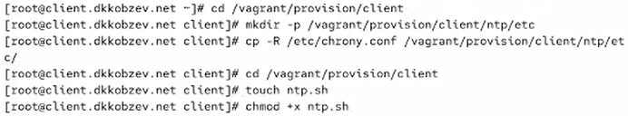
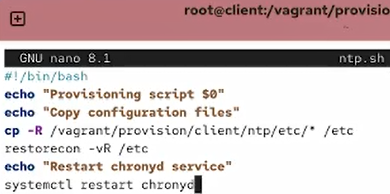
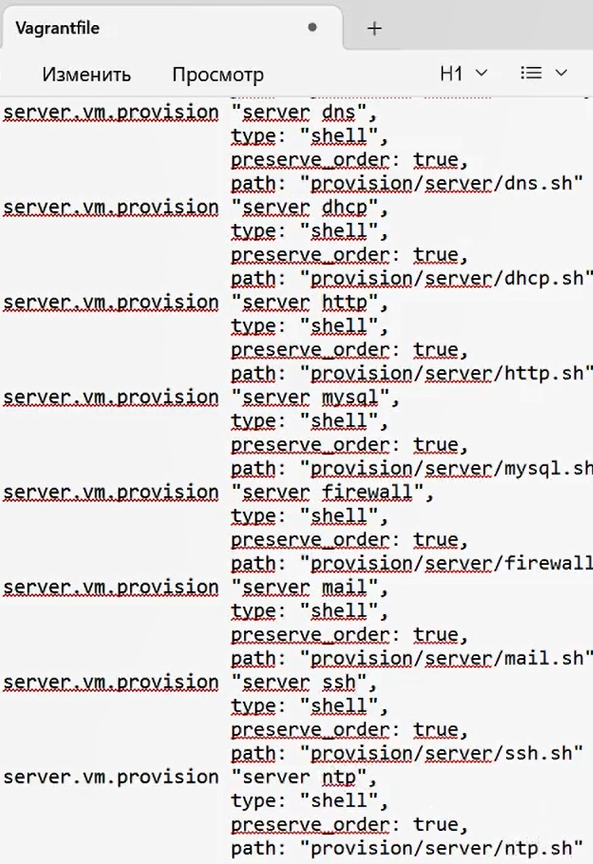
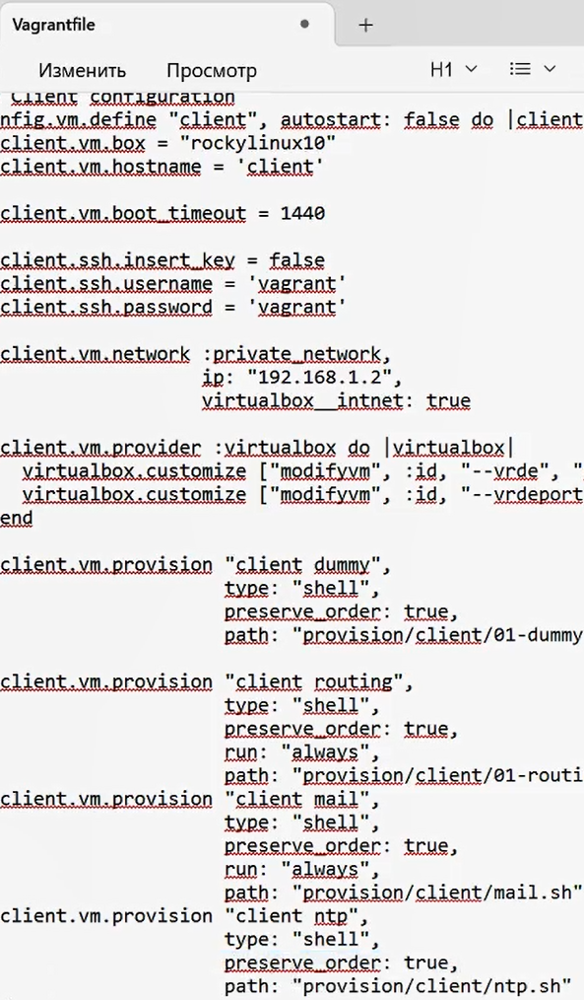

---
## Front matter
lang: ru-RU
title: Лабораторная работа
subtitle: Номер 12
author:
  - Кобзев Д. К. 
institute:
  - Российский университет дружбы народов, Москва, Россия
date: 22 ноября 2025

## i18n babel
babel-lang: russian
babel-otherlangs: english

## Pdf output format
fontsize: 8pt

## Formatting pdf
toc: false
toc-title: Содержание
slide_level: 2
aspectratio: 169
section-titles: true
theme: metropolis
##Fonts
mainfont: Liberation Serif
sansfont: Liberation Sans
monofont: Liberation Mono
---

# Информация

## Докладчик

:::::::::::::: {.columns align=center}
::: {.column width="70%"}

  * Кобзев Дмитрий Константинович
  * Студент
  * Российский университет дружбы народов
  * НПИбд-01-23

:::
::: {.column width="30%"}

:::
::::::::::::::

## Цель работы

Целью данной работы является получение навыков по управлению системным временем и настройке синхронизации времени.

## Настройка параметров времени

На сервере смотрим параметры настройки даты и времени и текущее системное время (Рис. 12.1).

{height=60%}

## Настройка параметров времени

На клиенте смотрим параметры настройки даты и времени и текущее системное время (Рис. 12.2).

{height=60%}

## Управление синхронизацией времени

Проверяем источники времени на клиенте и на сервере (Рис. 12.3), (Рис. 12.4).

{height=60%}

## Управление синхронизацией времени

{height=60%}

## Управление синхронизацией времени

На сервере открываем на редактирование файл /etc/chrony.conf и добавляем строку:
allow 192.168.0.0/16 (Рис. 12.5).

{height=60%}

## Управление синхронизацией времени

На сервере перезапускаем службу chronyd.

Настраиваем межсетевой экран на сервере (Рис. 12.6).

{height=60%}

## Управление синхронизацией времени

На клиенте открываем файл /etc/chrony.conf и добавляем строку: server server.user.net iburst (Рис. 12.7).

{height=60%}

## Управление синхронизацией времени

На клиенте перезапускаем службу chronyd.

Проверяем источники времени на клиенте и на сервере (Рис. 12.8), (Рис. 12.9).

{height=60%}

## Управление синхронизацией времени

{height=60%}

## Внесение изменений в настройки внутреннего окружения виртуальных машин

На виртуальной машине server переходим в каталог для внесения изменений в настройки внутреннего окружения /vagrant/provision/server/, создаем в нём каталог ntp, в который помещаем в соответствующие подкаталоги конфигурационные файлы.

В каталоге /vagrant/provision/server создаем исполняемый файл ntp.sh (Рис. 12.10).

{height=60%}

## Внесение изменений в настройки внутреннего окружения виртуальных машин

Редактируем файл ntp.sh (Рис. 12.11).

{height=60%}

## Внесение изменений в настройки внутреннего окружения виртуальных машин

На виртуальной машине client переходим в каталог для внесения изменений в настройки внутреннего окружения /vagrant/provision/client/, создаем в нём каталог ntp, в который помещаем в соответствующие подкаталоги конфигурационные файлы.

В каталоге /vagrant/provision/client создаем исполняемый файл ntp.sh (Рис. 12.12).

{height=60%}

## Внесение изменений в настройки внутреннего окружения виртуальных машин

Редактируем файл ntp.sh (Рис. 12.13).

{height=60%}

## Внесение изменений в настройки внутреннего окружения виртуальных машин

Для отработки созданных скриптов во время загрузки виртуальных машин server
и client в конфигурационном файле Vagrantfile добавляем в соответствующих разделах конфигураций для сервера и клиента (Рис. 12.14), (Рис. 12.15).

{height=60%}

## Внесение изменений в настройки внутреннего окружения виртуальных машин

{height=60%}

## Выводы

В результате выполнения лабораторной работы мною были получены навыки по управлению системным временем и настройке синхронизации времени.
