---
## Front matter
lang: ru-RU
title: Лабораторная работа
subtitle: Номер 13
author:
  - Кобзев Д. К. 
institute:
  - Российский университет дружбы народов, Москва, Россия
date: 22 ноября 2025

## i18n babel
babel-lang: russian
babel-otherlangs: english

## Pdf output format
fontsize: 8pt

## Formatting pdf
toc: false
toc-title: Содержание
slide_level: 2
aspectratio: 169
section-titles: true
theme: metropolis
##Fonts
mainfont: Liberation Serif
sansfont: Liberation Sans
monofont: Liberation Mono
---

# Информация

## Докладчик

:::::::::::::: {.columns align=center}
::: {.column width="70%"}

  * Кобзев Дмитрий Константинович
  * Студент
  * Российский университет дружбы народов
  * НПИбд-01-23

:::
::: {.column width="30%"}

:::
::::::::::::::

## Цель работы

Целью данной работы приобретение навыков настройки сервера NFS для удалённого доступа к ресурсам.

## Настройка сервера NFSv4

На сервере устанавливаем необходимое программное обеспечение.

На сервере создаем каталог, который предполагается сделать доступным всем
пользователям сети (Рис. 12.1).

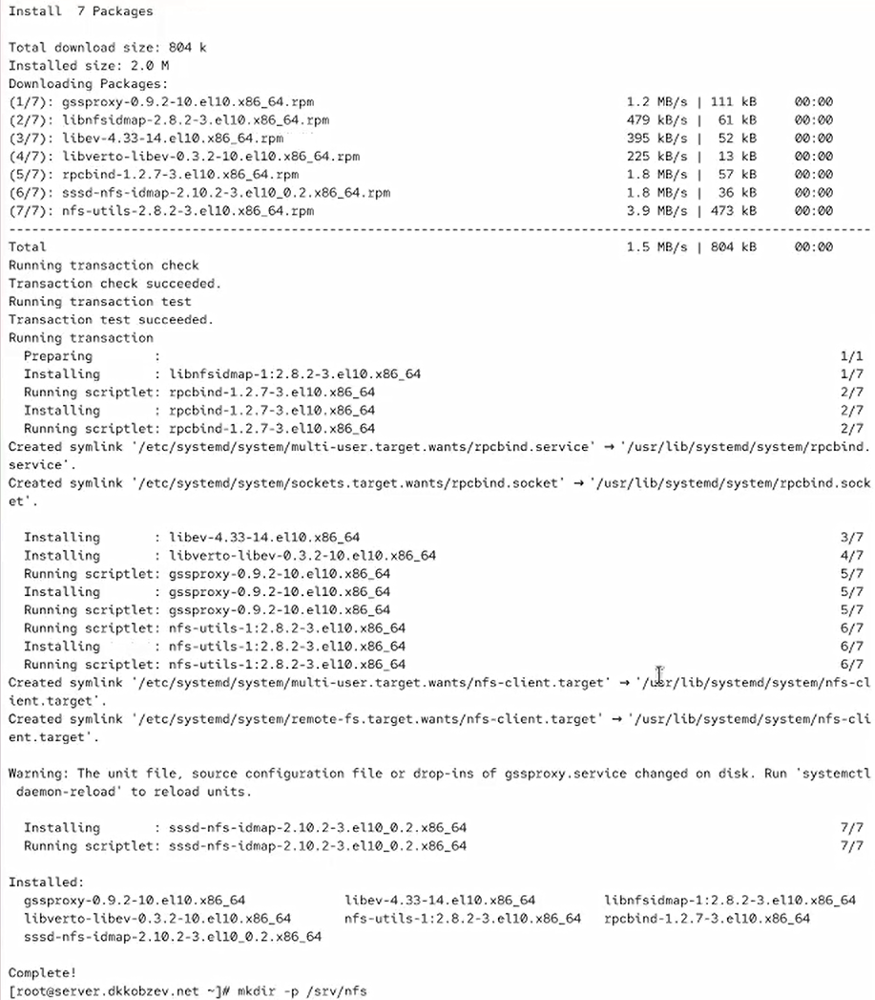{height=60%}

## Настройка сервера NFSv4

В файле /etc/exports прописываем подключаемый через NFS общий каталог с доступом только на чтение (Рис. 12.2).

{height=60%}

## Настройка сервера NFSv4

Для общего каталога задаем контекст безопасности NFS.

Применяем изменённую настройку SELinux к файловой системе.

Запускаем сервер NFS.

Настройте межсетевой экран для работы сервера NFS (Рис. 12.3).

{height=60%}

## Настройка сервера NFSv4

На клиенте устанавливаем необходимое для работы NFS программное обеспечение.

На клиенте пробуем посмотреть имеющиеся подмонтированные удалённые ресурсы  (Рис. 12.4).

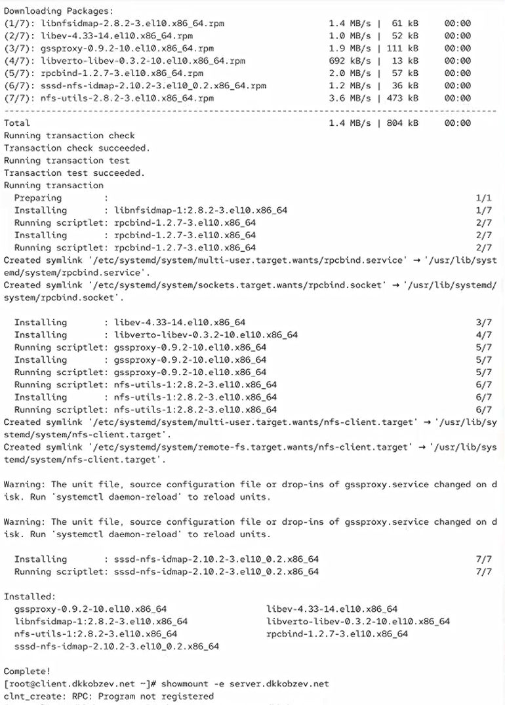{height=60%}

## Настройка сервера NFSv4

Пробуем на сервере остановить сервис межсетевого экрана (Рис. 12.5).

{height=60%}

## Настройка сервера NFSv4

На сервере запускаем сервис межсетевого экрана.

Добавляем службы rpc-bind и mountd в настройки межсетевого экрана на сервере (Рис. 12.6).

{height=60%}

## Настройка сервера NFSv4

На клиенте проверяем подключение удалённого ресурса (Рис. 12.7).

{height=60%}

## Монтирование NFS на клиенте

На клиенте создаем каталог, в который будет монтироваться удалённый ресурс, и подмонтируем дерево NFS.

Проверяем, что общий ресурс NFS подключён правильно (Рис. 12.8).

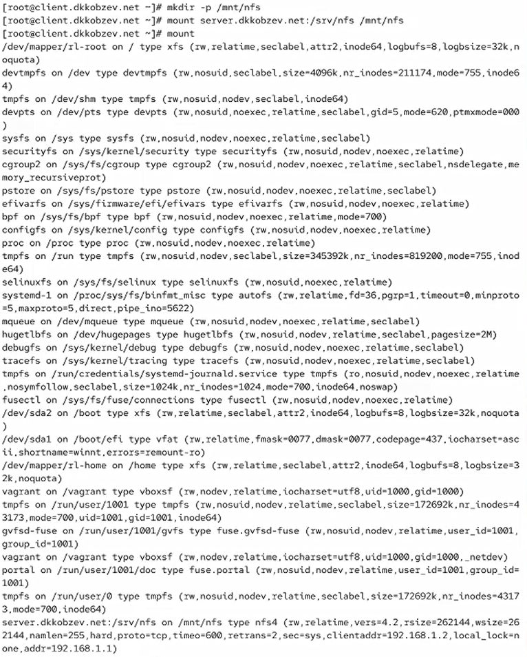{height=60%}

## Монтирование NFS на клиенте

На клиенте в конце файла /etc/fstab добавляем следующую запись: server.user.net:/srv/nfs /mnt/nfs nfs _netdev 0 0 (Рис. 12.9).

{height=60%}

## Монтирование NFS на клиенте

На клиенте проверяем наличие автоматического монтирования удалённых ресурсов при запуске операционной системы (Рис. 12.10).

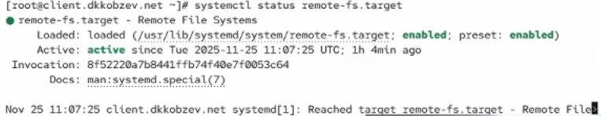{height=60%}

## Подключение каталогов к дереву NFS

На сервере создаем общий каталог, в который затем будет подмонтирован каталог с контентом веб-сервера.

Подмонтируем каталог web-сервера.

На сервере проверяем, что отображается в каталоге /srv/nfs (Рис. 12.11).

{height=60%}

## Подключение каталогов к дереву NFS

На сервере в файле /etc/exports добавляем экспорт каталога веб-сервера с удалённого ресурса (Рис. 12.12).

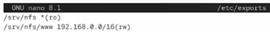{height=60%}

## Подключение каталогов к дереву NFS

На сервере в конце файла /etc/fstab добавляем следующую запись: /var/www /srv/nfs/www none bind 0 0 (Рис. 12.13).

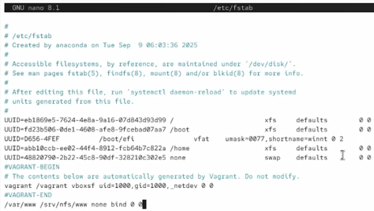{height=60%}

## Подключение каталогов к дереву NFS

Повторно экспортируем каталоги, указанные в файле /etc/exports.

На клиенте проверьте каталог /mnt/nfs (Рис. 12.14).

{height=60%}

## Подключение каталогов для работы пользователей

На сервере под пользователем user в его домашнем каталоге создаем каталог common с полными правами доступа только для этого пользователя, а в нём файл user@server.txt.

На сервере создаем общий каталог для работы пользователя user по сети.

Подмонтируем каталог common пользователя user в NFS (Рис. 12.15).

{height=60%}

## Подключение каталогов для работы пользователей

Подключаем каталог пользователя в файле /etc/exports, прописав в нём: /srv/nfs/home/user 192.168.0.0/16(rw) (Рис. 12.16).

{height=60%}

## Подключение каталогов для работы пользователей

Вносим изменения в файл /etc/fstab (Рис. 12.17).

{height=60%}

## Подключение каталогов для работы пользователей

Повторно экспортируйте каталоги.

На клиенте проверяем каталог /mnt/nfs.

На клиенте под пользователем user переходим в каталог /mnt/nfs/home/user и пробуем создать в нём файл user@client.txt и внести в него какие-либо изменения.

Пробуем проделать это под пользователем root. (Рис. 12.18).

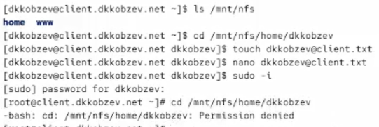{height=60%}

## Подключение каталогов для работы пользователей

На сервере смотрим, появились ли изменения в каталоге пользователя /home/user/common (Рис. 12.19).

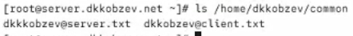{height=60%}

## Внесение изменений в настройки внутреннего окружения виртуальных машин

На виртуальной машине server переходим в каталог для внесения изменений в настройки внутреннего окружения /vagrant/provision/server/, создаем в нём каталог nfs, в который помещаем в соответствующие подкаталоги конфигурационные файлы (Рис. 12.20).

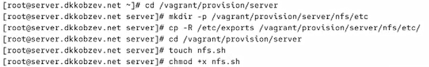{height=60%}

## Внесение изменений в настройки внутреннего окружения виртуальных машин

Прописываем скрипт в файле nfs.sh (Рис. 12.21).

{height=60%}

## Внесение изменений в настройки внутреннего окружения виртуальных машин

На виртуальной машине client переходим в каталог для внесения изменений в настройки внутреннего окружения /vagrant/provision/client/

В каталоге /vagrant/provision/client создаем исполняемый файл nfs.sh (Рис. 12.22).

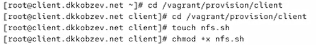{height=60%}

## Внесение изменений в настройки внутреннего окружения виртуальных машин

Прописываем скрипт в файле nfs.sh (Рис. 12.23).

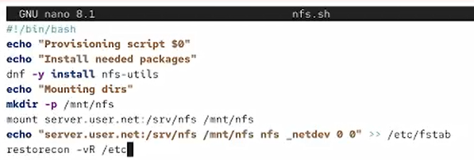{height=60%}

## Внесение изменений в настройки внутреннего окружения виртуальных машин

Для отработки созданных скриптов во время загрузки виртуальных машин server
и client в конфигурационном файле Vagrantfile добавляем в соответствующих разделах конфигураций для сервера и клиента (Рис. 12.24).

{height=60%}

## Выводы

В результате выполнения лабораторной работы мною были приобретены навыки настройки сервера NFS для удалённого доступа к ресурсам.
