---
## Front matter
lang: ru-RU
title: Лабораторная работа
subtitle: Номер 14
author:
  - Кобзев Д. К. 
institute:
  - Российский университет дружбы народов, Москва, Россия
date: 6 декабря 2025

## i18n babel
babel-lang: russian
babel-otherlangs: english

## Pdf output format
fontsize: 8pt

## Formatting pdf
toc: false
toc-title: Содержание
slide_level: 2
aspectratio: 169
section-titles: true
theme: metropolis
##Fonts
mainfont: Liberation Serif
sansfont: Liberation Sans
monofont: Liberation Mono
---

# Информация

## Докладчик

:::::::::::::: {.columns align=center}
::: {.column width="70%"}

  * Кобзев Дмитрий Константинович
  * Студент
  * Российский университет дружбы народов
  * НПИбд-01-23

:::
::: {.column width="30%"}

:::
::::::::::::::

## Цель работы

Целью данной работы является приобретение навыков настройки доступа групп пользователей к общим ресурсам по протоколу SMB.

## Настройка сервера Samba

На сервере устанавливаем необходимые пакеты.
Создаем группу sambagroup для пользователей, которые будут работать с Samba-сервером, и присваиваем ей GID 1010.
Добавляем пользователя user к группе sambagroup.
Создаем общий каталог в файловой системе Linux, в который предполагается монтировать разделяемые ресурсы (Рис. 12.1).

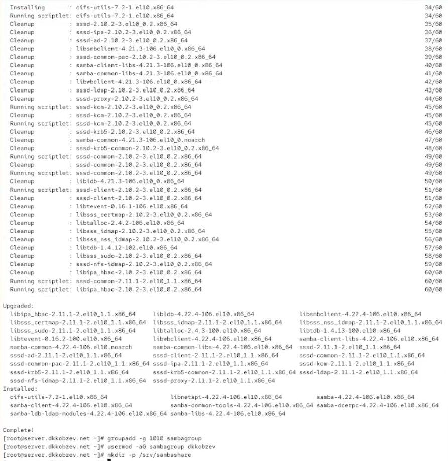{height=60%}

## Настройка сервера Samba

В файле конфигурации /etc/samba/smb.conf изменяем параметр рабочей группы и в конце файла добавляем раздел с описанием общего доступа к разделяемому ресурсу /srv/sambashare (Рис. 12.2).

{height=60%}

## Настройка сервера Samba

Убеждаемся, что я не сделал синтаксических ошибок в файле smb.conf (Рис. 12.3).

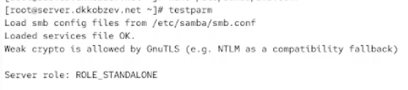{height=60%}

## Настройка сервера Samba

Запускаем демон Samba и смотрим его статус.
Для проверки наличия общего доступа пробуем подключиться к серверу с помощью smbclient (Рис. 12.4).

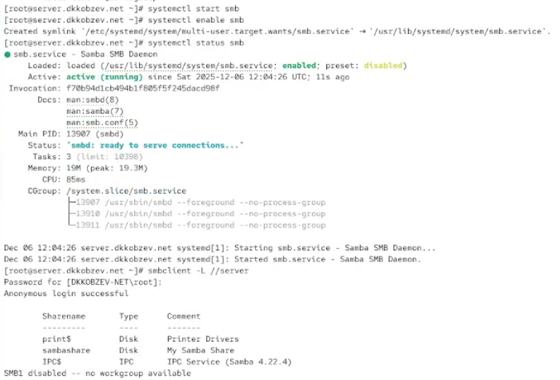{height=60%}

## Настройка сервера Samba

Смотрим файл конфигурации межсетевого экрана для Samba (Рис. 12.5).

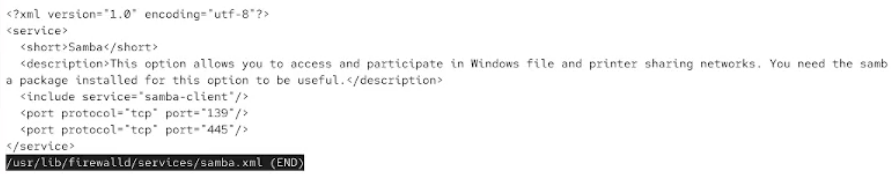{height=60%}

## Настройка сервера Samba

Настраиваем межсетевой экран.
Настраиваем права доступа для каталога с разделяемым ресурсом.
Смотрим контекст безопасности SELinux.
Настраиваем контекст безопасности SELinux для каталога с разделяемым ресурсом.
Проверяем, что контекст безопасности изменился.
Разрешаем экспортировать разделяемые ресурсы для чтения и записи.
Смотрим UID пользователя и в какие группы он включён.
Добавляем пользователя user в базу пользователей Samba (Рис. 12.6).

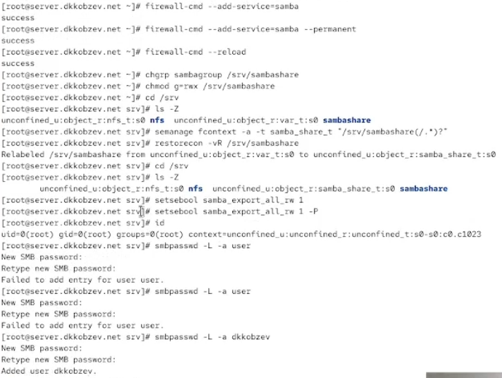{height=60%}

## Монтирование файловой системы Samba на клиенте

На клиенте смотрим файл конфигурации межсетевого экрана для клиента Samba (Рис. 12.7).

{height=60%}

## Монтирование файловой системы Samba на клиенте

На клиенте настраиваем межсетевой экран.
На клиенте создаем группу sambagroup и добавляем в неё пользователя user (Рис. 12.8).

{height=60%}

## Монтирование файловой системы Samba на клиенте

На клиенте в файле конфигурации /etc/samba/smb.conf измените параметр рабочей группы (Рис. 12.9).

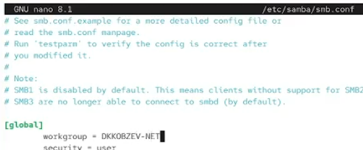{height=60%}

## Монтирование файловой системы Samba на клиенте

Подключаемся с клиента к серверу с помощью smbclient под учётной записью моего пользователя (Рис. 12.10).

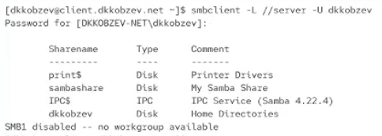{height=60%}

## Монтирование файловой системы Samba на клиенте

На клиенте создаем точку монтирования.
На клиенте получаем доступ к общему ресурсу с помощью mount.
Отмонтируем каталог /mnt/samba (Рис. 12.11).

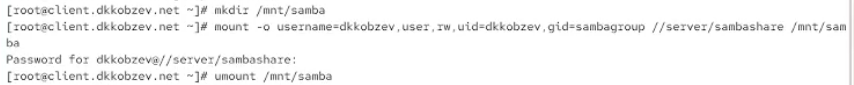{height=60%}

## Монтирование файловой системы Samba на клиенте

Убеждаемся, что user может записывать файлы на разделяемом ресурсе (Рис. 12.12).

{height=60%}

## Монтирование файловой системы Samba на клиенте

На клиенте создаем файл smbusers в каталоге /etc/samba/ (Рис. 12.13).

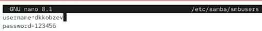{height=60%}

## Монтирование файловой системы Samba на клиенте

На клиенте в файле /etc/fstab добавляем следующую строку: //server/sambashare /mnt/samba cifs user,rw,uid=user_name,gid=sambagroup, credentials=/etc/samba/smbusers,_netdev 0 0.
Подмонтируем общий ресурс (Рис. 12.14).

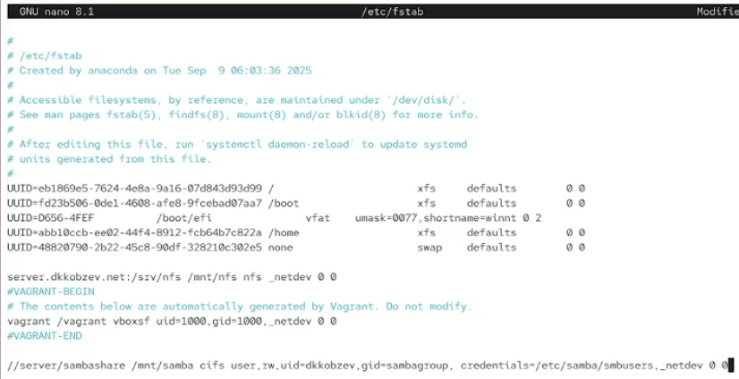{height=60%}

## Внесение изменений в настройки внутреннего окружения виртуальных машин

На виртуальной машине server переходим в каталог для внесения изменений в настройки внутреннего окружения /vagrant/provision/server/, создаем в нём каталог smb, в который помещаем в соответствующие подкаталоги конфигурационные файлы.
В каталоге /vagrant/provision/server создаем файл smb.sh (Рис. 12.15).

{height=60%}

## Внесение изменений в настройки внутреннего окружения виртуальных машин

Прописываем скрипт в smb.sh (Рис. 12.16).

{height=60%}

## Внесение изменений в настройки внутреннего окружения виртуальных машин

На виртуальной машине client переходим в каталог для внесения изменений в настройки внутреннего окружения /vagrant/provision/client/, создаем в нём каталог smb, в который помещаем в соответствующие подкаталоги конфигурационные файлы.
В каталоге /vagrant/provision/client создаем файл smb.sh (Рис. 12.17).

{height=60%}

## Внесение изменений в настройки внутреннего окружения виртуальных машин

Прописываем скрипт в smb.sh (Рис. 12.18).

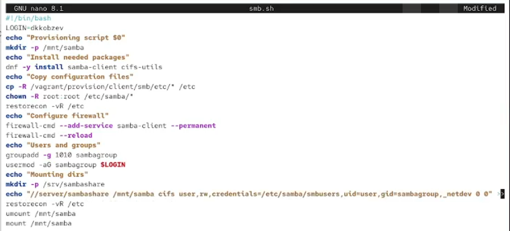{height=60%}

## Внесение изменений в настройки внутреннего окружения виртуальных машин

Для отработки созданного скрипта во время загрузки виртуальных машин server и client в конфигурационном файле Vagrantfile добавляем в разделе конфигурации для сервера и клиент (Рис. 12.19), (Рис. 12.20).

{height=60%}

## Внесение изменений в настройки внутреннего окружения виртуальных машин

{height=60%}

## Выводы

В результате выполнения лабораторной работы мною были приобретены навыки настройки доступа групп пользователей к общим ресурсам по протоколу SMB.