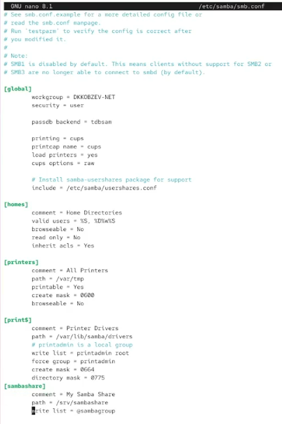
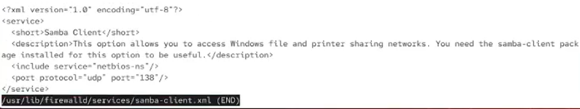
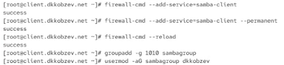
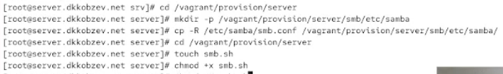
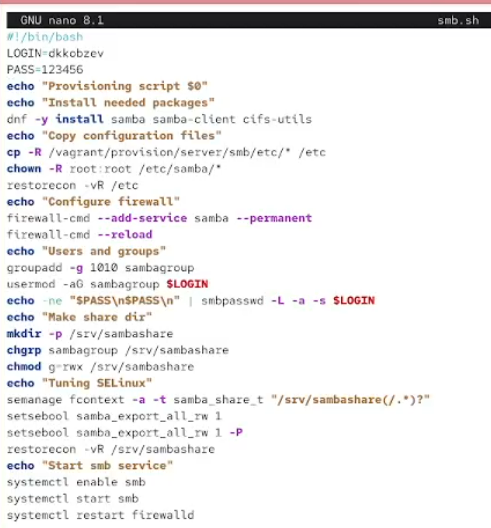
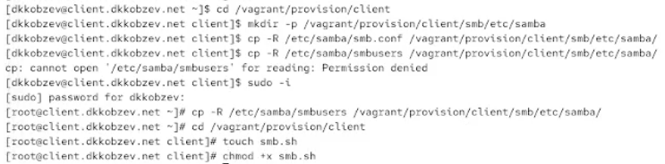
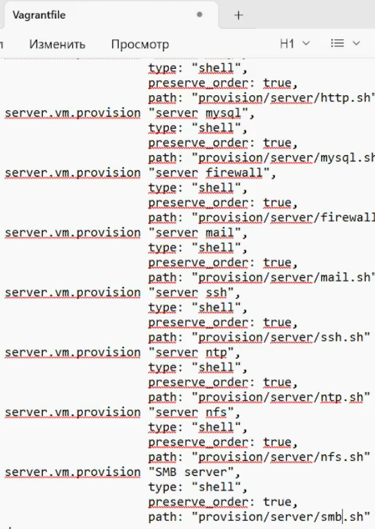
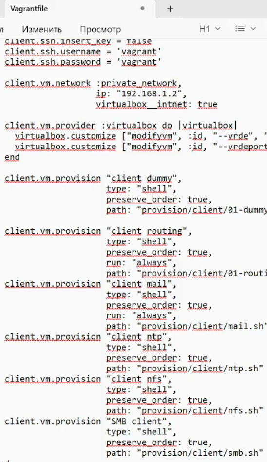

---
## Front matter
title: Лабораторная работа
subtitle: Номер 14
author: "Кобзев Д. К."

## Generic otions
lang: ru-RU
toc-title: "Содержание"

## Bibliography
bibliography: bib/cite.bib
csl: /home/dkkobzev/pandoc/csl/gost-r-7-0-5-2008-numeric.csl

## Pdf output format
toc: true # Table of contents
toc-depth: 2
lof: true # List of figures
lot: true # List of tables
fontsize: 12pt
linestretch: 1.5
papersize: a4
documentclass: scrreprt
## I18n polyglossia
polyglossia-lang:
  name: russian
  options:
	- spelling=modern
	- babelshorthands=true
polyglossia-otherlangs:
  name: english
## I18n babel
babel-lang: russian
babel-otherlangs: english
## Fonts
mainfont: Liberation Serif
romanfont: Liberation Serif
sansfont: Liberation Sans
monofont: Liberation Mono
mathfont: STIX Two Math
mainfontoptions: Ligatures=Common,Ligatures=TeX,Scale=0.94
romanfontoptions: Ligatures=Common,Ligatures=TeX,Scale=0.94
sansfontoptions: Ligatures=Common,Ligatures=TeX,Scale=MatchLowercase,Scale=0.94
monofontoptions: Scale=MatchLowercase,Scale=0.94,FakeStretch=0.9

## Pandoc-crossref LaTeX customization
figureTitle: "Рис."
tableTitle: "Таблица"
listingTitle: "Листинг"
lofTitle: "Список иллюстраций"
lotTitle: "Список таблиц"
lolTitle: "Листинги"
## Misc options
indent: true
header-includes:
  - \usepackage{indentfirst}
  - \usepackage{float} # keep figures where there are in the text
  - \floatplacement{figure}{H} # keep figures where there are in the text
---

# Цель работы

Целью данной работы является приобретение навыков настройки доступа групп пользователей к общим ресурсам по протоколу SMB.

# Выполнение лабораторной работы

На сервере устанавливаем необходимые пакеты.
Создаем группу sambagroup для пользователей, которые будут работать с Samba-сервером, и присваиваем ей GID 1010.
Добавляем пользователя user к группе sambagroup.
Создаем общий каталог в файловой системе Linux, в который предполагается монтировать разделяемые ресурсы (Рис. 12.1).

{height=60%}

В файле конфигурации /etc/samba/smb.conf изменяем параметр рабочей группы и в конце файла добавляем раздел с описанием общего доступа к разделяемому ресурсу /srv/sambashare (Рис. 12.2).

{height=60%}

Убеждаемся, что я не сделал синтаксических ошибок в файле smb.conf (Рис. 12.3).

{height=60%}

Запускаем демон Samba и смотрим его статус.
Для проверки наличия общего доступа пробуем подключиться к серверу с помощью smbclient (Рис. 12.4).

{height=60%}

Смотрим файл конфигурации межсетевого экрана для Samba (Рис. 12.5).

{height=60%}

Настраиваем межсетевой экран.
Настраиваем права доступа для каталога с разделяемым ресурсом.
Смотрим контекст безопасности SELinux.
Настраиваем контекст безопасности SELinux для каталога с разделяемым ресурсом.
Проверяем, что контекст безопасности изменился.
Разрешаем экспортировать разделяемые ресурсы для чтения и записи.
Смотрим UID пользователя и в какие группы он включён.
Добавляем пользователя user в базу пользователей Samba (Рис. 12.6).

{height=60%}

На клиенте смотрим файл конфигурации межсетевого экрана для клиента Samba (Рис. 12.7).

{height=60%}

На клиенте настраиваем межсетевой экран.
На клиенте создаем группу sambagroup и добавляем в неё пользователя user (Рис. 12.8).

{height=60%}

На клиенте в файле конфигурации /etc/samba/smb.conf измените параметр рабочей группы (Рис. 12.9).

{height=60%}

Подключаемся с клиента к серверу с помощью smbclient под учётной записью моего пользователя (Рис. 12.10).

{height=60%}

На клиенте создаем точку монтирования.
На клиенте получаем доступ к общему ресурсу с помощью mount.
Отмонтируем каталог /mnt/samba (Рис. 12.11).

{height=60%}

Убеждаемся, что user может записывать файлы на разделяемом ресурсе (Рис. 12.12).

{height=60%}

На клиенте создаем файл smbusers в каталоге /etc/samba/ (Рис. 12.13).

{height=60%}

На клиенте в файле /etc/fstab добавляем следующую строку: //server/sambashare /mnt/samba cifs user,rw,uid=user_name,gid=sambagroup, credentials=/etc/samba/smbusers,_netdev 0 0.
Подмонтируем общий ресурс (Рис. 12.14).

{height=60%}

На виртуальной машине server переходим в каталог для внесения изменений в настройки внутреннего окружения /vagrant/provision/server/, создаем в нём каталог smb, в который помещаем в соответствующие подкаталоги конфигурационные файлы.
В каталоге /vagrant/provision/server создаем файл smb.sh (Рис. 12.15).

{height=60%}

Прописываем скрипт в smb.sh (Рис. 12.16).

{height=60%}

На виртуальной машине client переходим в каталог для внесения изменений в настройки внутреннего окружения /vagrant/provision/client/, создаем в нём каталог smb, в который помещаем в соответствующие подкаталоги конфигурационные файлы.
В каталоге /vagrant/provision/client создаем файл smb.sh (Рис. 12.17).

{height=60%}

Прописываем скрипт в smb.sh (Рис. 12.18).

{height=60%}

Для отработки созданного скрипта во время загрузки виртуальных машин server и client в конфигурационном файле Vagrantfile добавляем в разделе конфигурации для сервера и клиент (Рис. 12.19), (Рис. 12.20).

{height=60%}

{height=60%}

# Выводы

В результате выполнения лабораторной работы мною были приобретены навыки настройки доступа групп пользователей к общим ресурсам по протоколу SMB.

# Список литературы{.unnumbered}