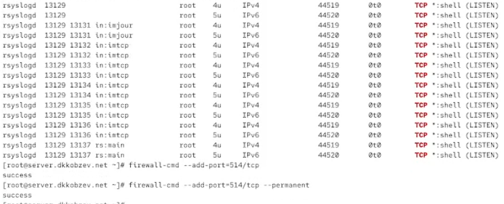
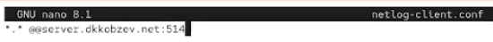
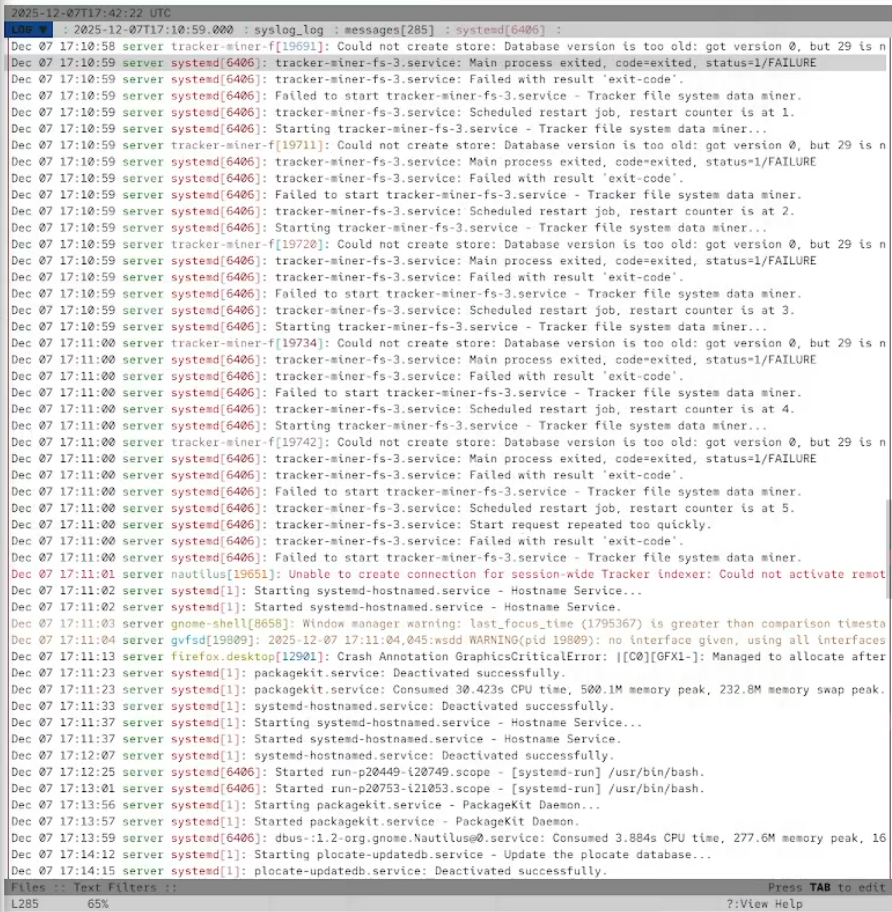
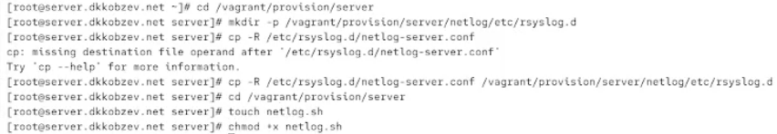
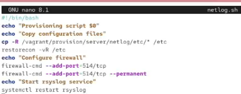
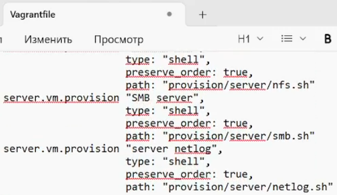
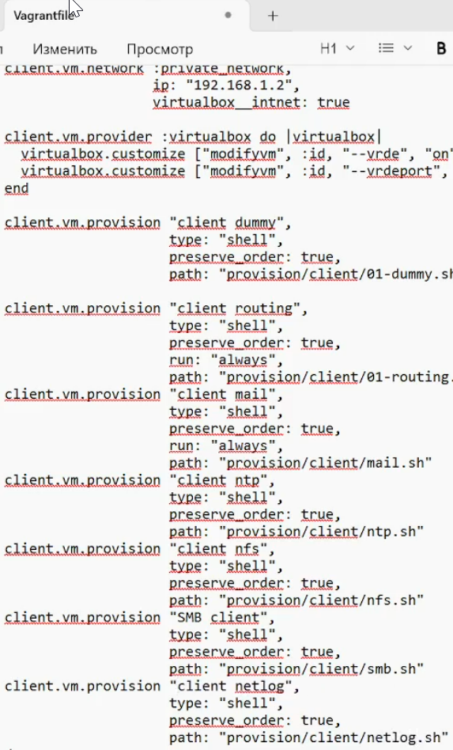

---
## Front matter
lang: ru-RU
title: Лабораторная работа
subtitle: Номер 15
author:
  - Кобзев Д. К. 
institute:
  - Российский университет дружбы народов, Москва, Россия
date: 7 декабря 2025

## i18n babel
babel-lang: russian
babel-otherlangs: english

## Pdf output format
fontsize: 8pt

## Formatting pdf
toc: false
toc-title: Содержание
slide_level: 2
aspectratio: 169
section-titles: true
theme: metropolis
##Fonts
mainfont: Liberation Serif
sansfont: Liberation Sans
monofont: Liberation Mono
---

# Информация

## Докладчик

:::::::::::::: {.columns align=center}
::: {.column width="70%"}

  * Кобзев Дмитрий Константинович
  * Студент
  * Российский университет дружбы народов
  * НПИбд-01-23

:::
::: {.column width="30%"}

:::
::::::::::::::

## Цель работы

Целью данной работы является получение навыков по работе с журналами системных событий.

## Настройка сервера сетевого журнала

На сервере создаем файл конфигурации сетевого хранения журналов (Рис. 12.1).

{height=60%}

## Настройка сервера сетевого журнала

В файле конфигурации /etc/rsyslog.d/netlog-server.conf включаем приём записей журнала по TCP-порту 514 (Рис. 12.2).

{height=60%}

## Настройка сервера сетевого журнала

Перезапускаем службу rsyslog и смотрим, какие порты, связанные с rsyslog, прослушиваются.
На сервере настраиваем межсетевой экран для приёма сообщений по TCP-порту 514 (Рис. 12.3).

{height=60%}

## Настройка клиента сетевого журнала

На клиенте создаем файл конфигурации сетевого хранения журналов (Рис. 12.4).

{height=60%}

## Настройка клиента сетевого журнала

На клиенте в файле конфигурации /etc/rsyslog.d/netlog-client.conf включаем перенаправление сообщений журнала на 514 TCP-порт сервера (Рис. 12.5).

{height=60%}

## Настройка клиента сетевого журнала

Перезапускаем службу rsyslog (Рис. 12.6).

{height=60%}

## Просмотр журнала

На сервере смотрим один из файлов журнала (Рис. 12.7).

{height=60%}

## Просмотр журнала

На сервере под пользователем user запускаем графическую программу для просмотра журналов (Рис. 12.8).

{height=60%}

## Просмотр журнала

Просмотрите логи с сервера с помощью lnav (Рис. 12.9).

{height=60%}

## Просмотр журнала

Просмотрите логи с клиента с помощью lnav (Рис. 12.10).

{height=60%}

## Внесение изменений в настройки внутреннего окружения виртуальных машин

На виртуальной машине server переходим в каталог для внесения изменений в настройки внутреннего окружения /vagrant/provision/server/, создаем в нём каталог netlog, в который помещаем в соответствующие подкаталоги конфигурационные файлы.
В каталоге /vagrant/provision/server создаем файл netlog.sh (Рис. 12.11).

{height=60%}

## Внесение изменений в настройки внутреннего окружения виртуальных машин

Прописываем скрипт в netlog.sh (Рис. 12.12).

{height=60%}

## Внесение изменений в настройки внутреннего окружения виртуальных машин

На виртуальной машине client переходим в каталог для внесения изменений в настройки внутреннего окружения /vagrant/provision/client/, создаем в нём каталог netlog, в который помещаем в соответствующие подкаталоги конфигурационные файлы.
В каталоге /vagrant/provision/client создаем файл netlog.sh (Рис. 12.13).

{height=60%}

## Внесение изменений в настройки внутреннего окружения виртуальных машин

Прописываем скрипт в netlog.sh (Рис. 12.14).

{height=60%}

## Внесение изменений в настройки внутреннего окружения виртуальных машин

Для отработки созданного скрипта во время загрузки виртуальных машин server и client в конфигурационном файле Vagrantfile добавляем в разделе конфигурации для сервера и клиент (Рис. 12.15), (Рис. 12.16).

{height=60%}

## Внесение изменений в настройки внутреннего окружения виртуальных машин

{height=60%}

## Выводы

В результате выполнения лабораторной работы мною были получены навыки по работе с журналами системных событий.