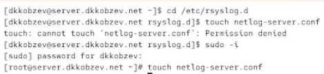
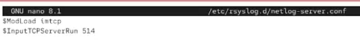
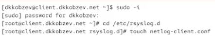
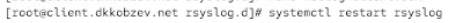
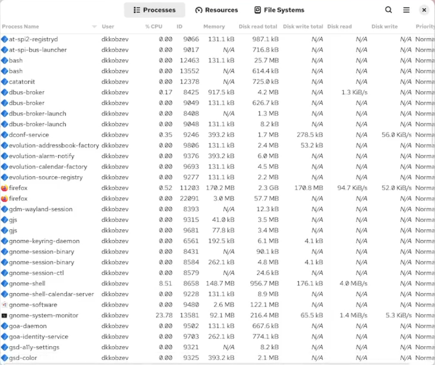
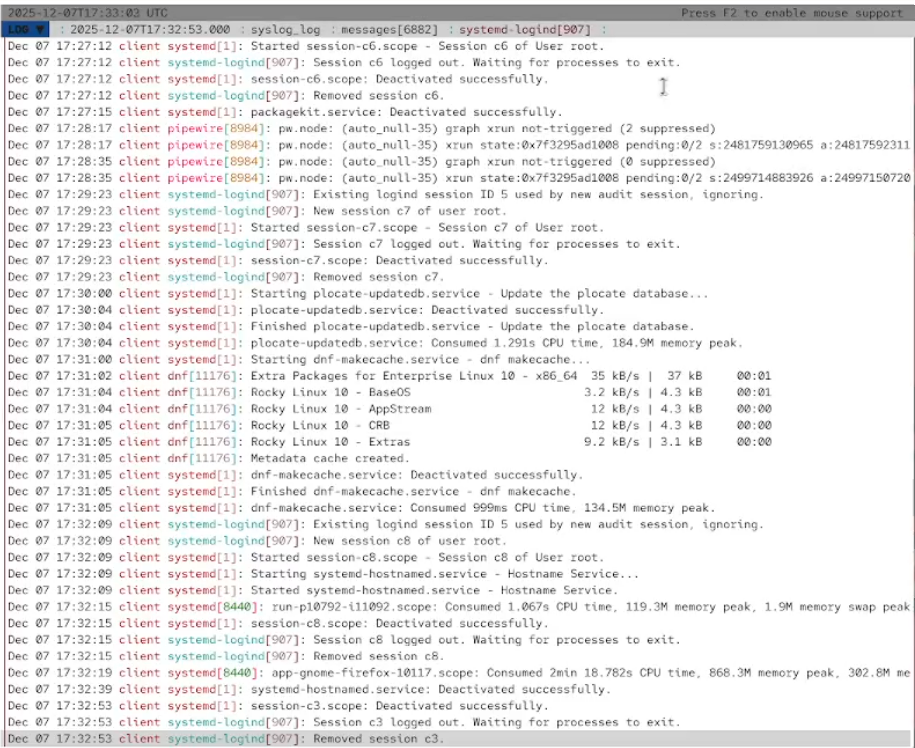
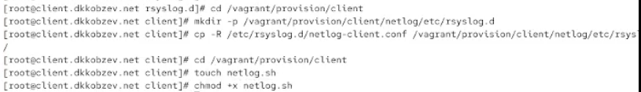
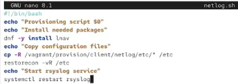

---
## Front matter
title: Лабораторная работа
subtitle: Номер 15
author: "Кобзев Д. К."

## Generic otions
lang: ru-RU
toc-title: "Содержание"

## Bibliography
bibliography: bib/cite.bib
csl: /home/dkkobzev/pandoc/csl/gost-r-7-0-5-2008-numeric.csl

## Pdf output format
toc: true # Table of contents
toc-depth: 2
lof: true # List of figures
lot: true # List of tables
fontsize: 12pt
linestretch: 1.5
papersize: a4
documentclass: scrreprt
## I18n polyglossia
polyglossia-lang:
  name: russian
  options:
	- spelling=modern
	- babelshorthands=true
polyglossia-otherlangs:
  name: english
## I18n babel
babel-lang: russian
babel-otherlangs: english
## Fonts
mainfont: Liberation Serif
romanfont: Liberation Serif
sansfont: Liberation Sans
monofont: Liberation Mono
mathfont: STIX Two Math
mainfontoptions: Ligatures=Common,Ligatures=TeX,Scale=0.94
romanfontoptions: Ligatures=Common,Ligatures=TeX,Scale=0.94
sansfontoptions: Ligatures=Common,Ligatures=TeX,Scale=MatchLowercase,Scale=0.94
monofontoptions: Scale=MatchLowercase,Scale=0.94,FakeStretch=0.9

## Pandoc-crossref LaTeX customization
figureTitle: "Рис."
tableTitle: "Таблица"
listingTitle: "Листинг"
lofTitle: "Список иллюстраций"
lotTitle: "Список таблиц"
lolTitle: "Листинги"
## Misc options
indent: true
header-includes:
  - \usepackage{indentfirst}
  - \usepackage{float} # keep figures where there are in the text
  - \floatplacement{figure}{H} # keep figures where there are in the text
---

# Цель работы

Целью данной работы является получение навыков по работе с журналами системных событий.

# Выполнение лабораторной работы

На сервере создаем файл конфигурации сетевого хранения журналов (Рис. 12.1).

{height=60%}

В файле конфигурации /etc/rsyslog.d/netlog-server.conf включаем приём записей журнала по TCP-порту 514 (Рис. 12.2).

{height=60%}

Перезапускаем службу rsyslog и смотрим, какие порты, связанные с rsyslog, прослушиваются.
На сервере настраиваем межсетевой экран для приёма сообщений по TCP-порту 514 (Рис. 12.3).

{height=60%}

На клиенте создаем файл конфигурации сетевого хранения журналов (Рис. 12.4).

{height=60%}

На клиенте в файле конфигурации /etc/rsyslog.d/netlog-client.conf включаем перенаправление сообщений журнала на 514 TCP-порт сервера (Рис. 12.5).

{height=60%}

Перезапускаем службу rsyslog (Рис. 12.6).

{height=60%}

На сервере смотрим один из файлов журнала (Рис. 12.7).

{height=60%}

На сервере под пользователем user запускаем графическую программу для просмотра журналов (Рис. 12.8).

{height=60%}

Просмотрите логи с сервера с помощью lnav (Рис. 12.9).

{height=60%}

Просмотрите логи с клиента с помощью lnav (Рис. 12.10).

{height=60%}

На виртуальной машине server переходим в каталог для внесения изменений в настройки внутреннего окружения /vagrant/provision/server/, создаем в нём каталог netlog, в который помещаем в соответствующие подкаталоги конфигурационные файлы.
В каталоге /vagrant/provision/server создаем файл netlog.sh (Рис. 12.11).

{height=60%}

Прописываем скрипт в netlog.sh (Рис. 12.12).

{height=60%}

На виртуальной машине client переходим в каталог для внесения изменений в настройки внутреннего окружения /vagrant/provision/client/, создаем в нём каталог netlog, в который помещаем в соответствующие подкаталоги конфигурационные файлы.
В каталоге /vagrant/provision/client создаем файл netlog.sh (Рис. 12.13).

{height=60%}

Прописываем скрипт в netlog.sh (Рис. 12.14).

{height=60%}

Для отработки созданного скрипта во время загрузки виртуальных машин server и client в конфигурационном файле Vagrantfile добавляем в разделе конфигурации для сервера и клиент (Рис. 12.15), (Рис. 12.16).

{height=60%}

{height=60%}

# Выводы

В результате выполнения лабораторной работы мною были получены навыки по работе с журналами системных событий.

# Список литературы{.unnumbered}