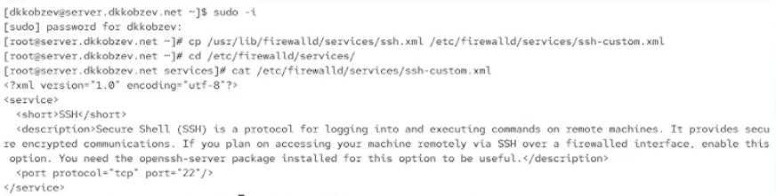
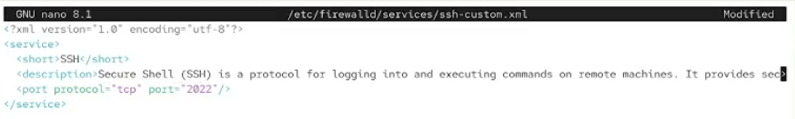
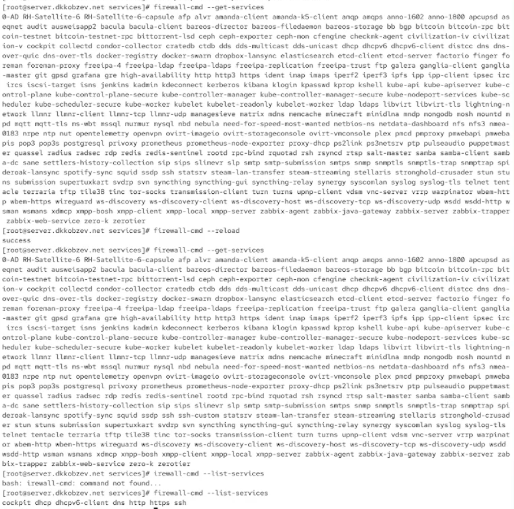
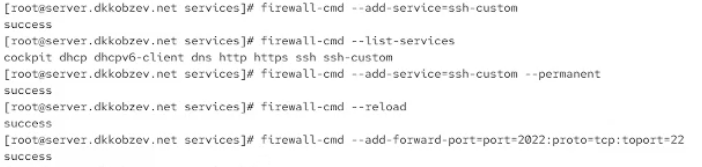
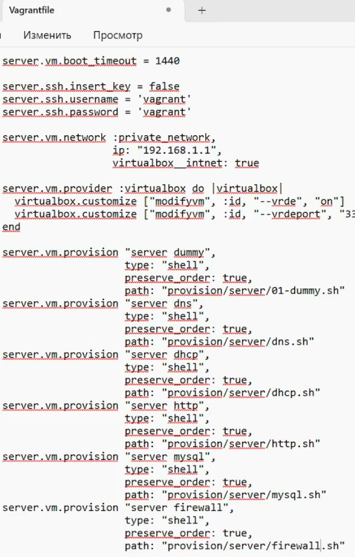

---
## Front matter
lang: ru-RU
title: Лабораторная работа
subtitle: Номер 7
author:
  - Кобзев Д. К. 
institute:
  - Российский университет дружбы народов, Москва, Россия
date: 5 декабря 2025

## i18n babel
babel-lang: russian
babel-otherlangs: english

## Pdf output format
fontsize: 8pt

## Formatting pdf
toc: false
toc-title: Содержание
slide_level: 2
aspectratio: 169
section-titles: true
theme: metropolis
##Fonts
mainfont: Liberation Serif
sansfont: Liberation Sans
monofont: Liberation Mono
---

# Информация

## Докладчик

:::::::::::::: {.columns align=center}
::: {.column width="70%"}

  * Кобзев Дмитрий Константинович
  * Студент
  * Российский университет дружбы народов
  * НПИбд-01-23

:::
::: {.column width="30%"}

:::
::::::::::::::

## Цель работы

Целью данной работы является получение навыков настройки межсетевого экрана в Linux в части переадресации портов и настройки Masquerading.

## Создание пользовательской службы firewalld

На виртуальной машине server переходим в режим суперпользователя.
На основе существующего файла описания службы ssh создаем файл с собственным описанием.
Смотрим содержимое файла службы (Рис. 12.1).

{height=60%}

## Создание пользовательской службы firewalld

Открываем файл описания службы на редактирование и заменяем порт 22 на новый порт (2022) (Рис. 12.2).

{height=60%}

## Создание пользовательской службы firewalld

Смотрим список доступных FirewallD служб.
Перегружаем правила межсетевого экрана с сохранением информации о состоянии и вновь выводим на экран список служб, а также список активных служб (Рис. 12.3).

{height=60%}

## Создание пользовательской службы firewalld

Добавляем новую службу в FirewallD и выводим на экран список активных служб.
Перегружаем правила межсетевого экрана с сохранением информации о состоянии.
Организовываем на сервере переадресацию с порта 2022 на порт 22 (Рис. 12.4).

{height=60%}

## Перенаправление портов

На клиенте пробуем получить доступ по SSH к серверу через порт 2022 (Рис. 12.5).

{height=60%}

## Настройка Port Forwarding и Masquerading

На сервере смотрим, активирована ли в ядре системы возможность перенаправления IPv4-пакетов пакетов.
Включаем перенаправление IPv4-пакетов на сервере.
Включаем маскарадинг на сервере (Рис. 12.6).

{height=60%}

## Внесение изменений в настройки внутреннего окружения виртуальной машины

На виртуальной машине server переходим в каталог для внесения изменений в настройки внутреннего окружения /vagrant/provision/server/, создаем в нём каталог firewall, в который помещаем в соответствующие подкаталоги конфигурационные файлы FirewallD.
В каталоге /vagrant/provision/server создаем файл firewall.sh (Рис. 12.7).

{height=60%}

## Внесение изменений в настройки внутреннего окружения виртуальной машины

Прописываем скрипт в firewall.sh (Рис. 12.8).

{height=60%}

## Внесение изменений в настройки внутреннего окружения виртуальной машины

Для отработки созданного скрипта во время загрузки виртуальной машины server в конфигурационном файле Vagrantfile добавляем в разделе конфигурации для сервер (Рис. 12.9).

{height=60%}

## Выводы

В результате выполнения лабораторной работы мною были получены навыки настройки межсетевого экрана в Linux в части переадресации портов и настройки Masquerading.
